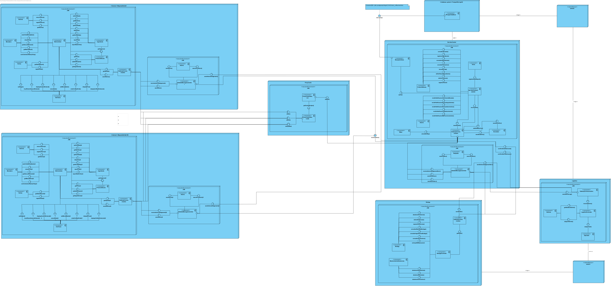

# Coffee_Machine

  Proyecto de "Sistemas Distribuidos" para la simulación de una empresa que tiene muchas maquinas de cafe alrededor de una ciudad, 
en este caso Cali. Para el desarrollo de este sistema se utilizó el Middleware ICE, junto con Java 11 y Gradle, con los que se
crearon los sistemas de Servidor Central, Logistica, Bodega y el de la Maquina de Cafe. Adicional a estos, se crearon sistemas
que funcionaban para implementar algunos patrones de diseño, como el proxy-cache, junto con el publisher/suscriber, y el 
reliable-messaging.

## Miembros

  <table>
    <tr>
      <td align="center">
        <a href="https://github.com/Rockthor1106">
          
           
          <b>Jhan Carlos Carvajal</b>
        </a>
      </td>
      <td align="center">
        <a href="https://github.com/Rockthor1106">
          
           
          <b>Juan David Cruz</b>
        </a>
      </td>
      <td align="center">
        <a href="https://github.com/GilmarAmezquita">
          
           
          <b>Gilmar Andres Amezquita</b>
        </a>
      </td>
      <td align="center">
        <a href="https://github.com/Juanperezaa">
          
           
          <b>Sebastian Perez</b>
        </a>
      </td>
    </tr>
  </table>

## Diagrama de Despliegue

  

